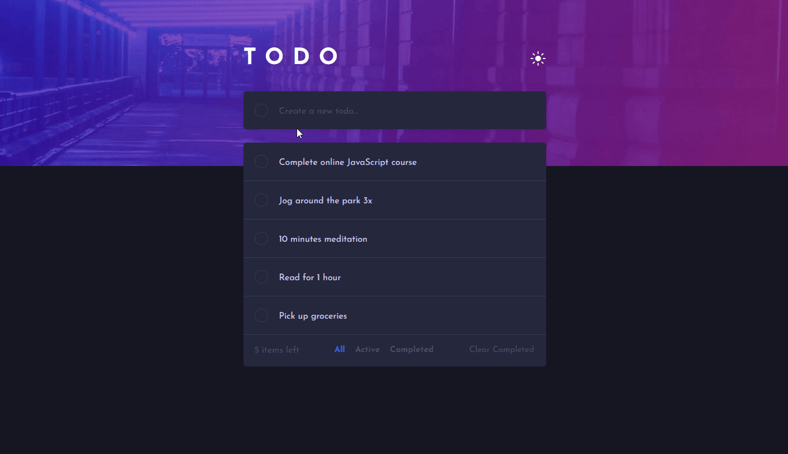
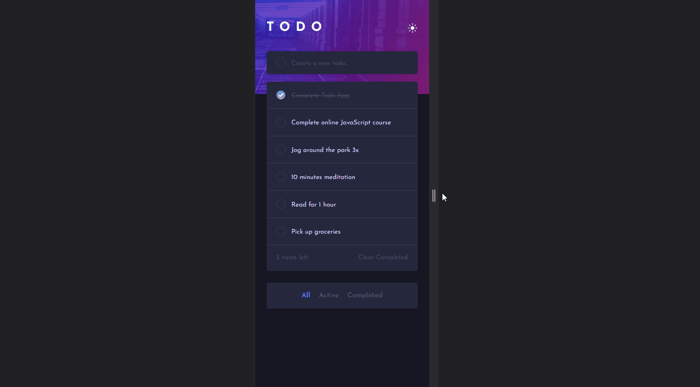

# Frontend Mentor: Todo app

Este repositório contém um app de lista de tarefas desenvolvido com base no [desafio da plataforma Frontend Mentor](https://www.frontendmentor.io/challenges/todo-app-Su1_KokOW).

## 📁 Detalhes do projeto

A proposta para este projeto foi desenvolver um CRUD com JavaScript puro. Para o armazenamento de dados utilizei o Local Storage.

**Features do projeto:**

	

 

- Visualizar o layout ideal do app de acordo com o tamanho da tela do dispositivo;
- Ver os estados de foco para todos os elementos interativos da página;
- Adicionar novas tarefas à lista;
- Marcar tarefas como concluídas;
- Excluir tarefas da lista;
- Filtragem de tarefas;
- Limpar todas as tarefas concluídas;
- Alternar entre o modo claro e escuro.

Para desenvolver a aplicação optei pela abordagem mobile-first. E para a estilização utilizei o Bootstrap com Sass.

	

 

## 👩‍💻 Tecnologias utilizadas

	
	
	
	

Desenvolvido com 💙 por [Juliana Lucca](https://www.linkedin.com/in/julianalucca/).